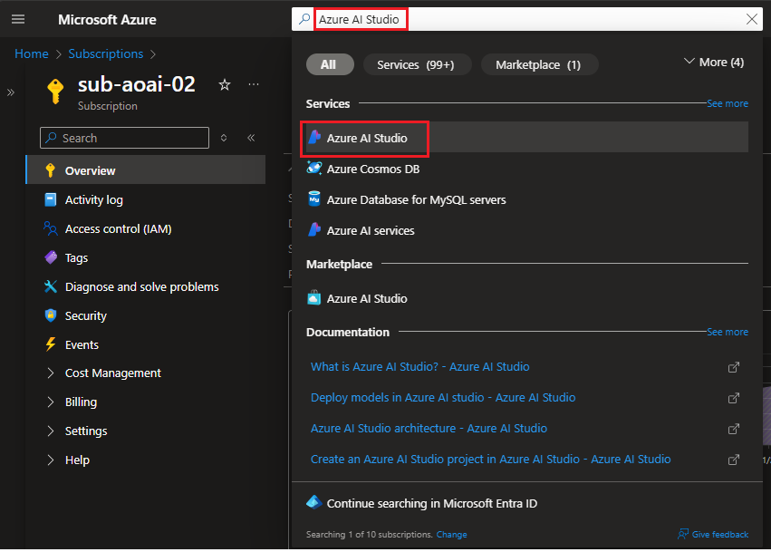
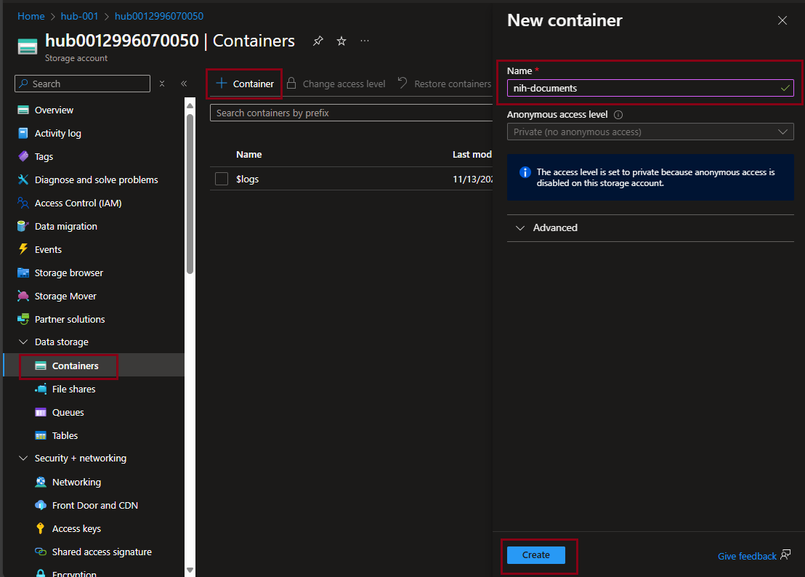
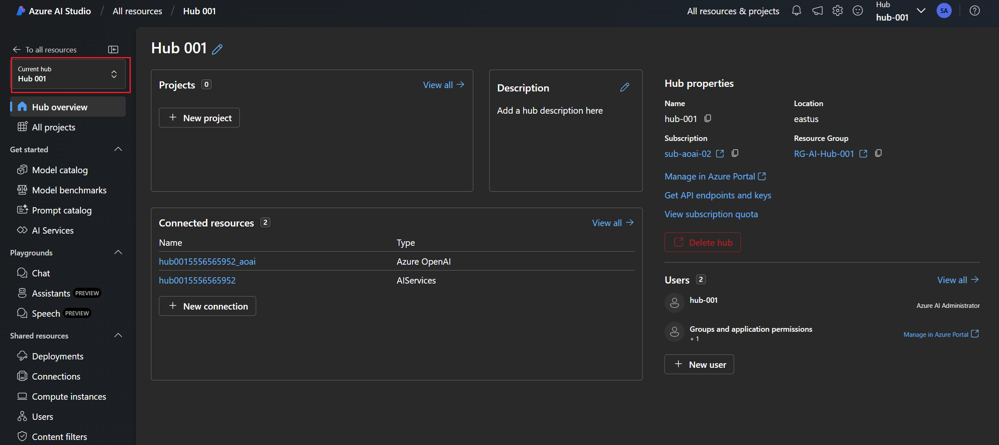
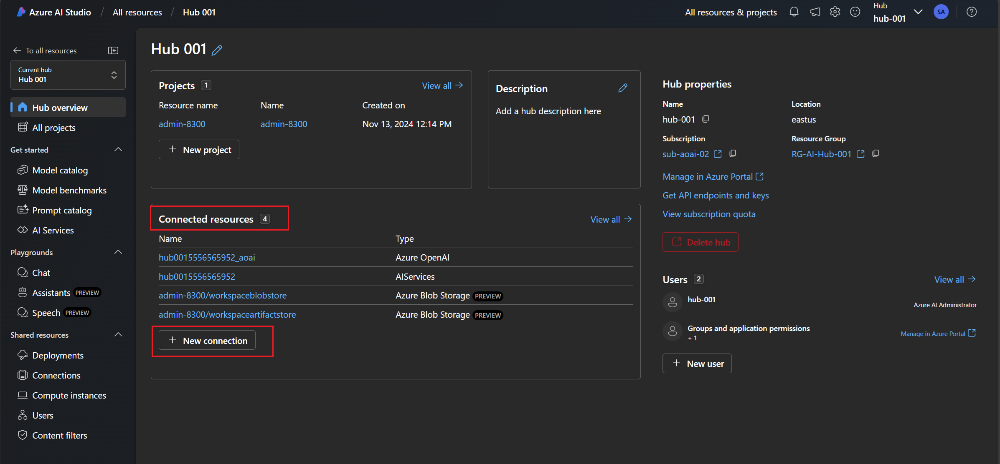
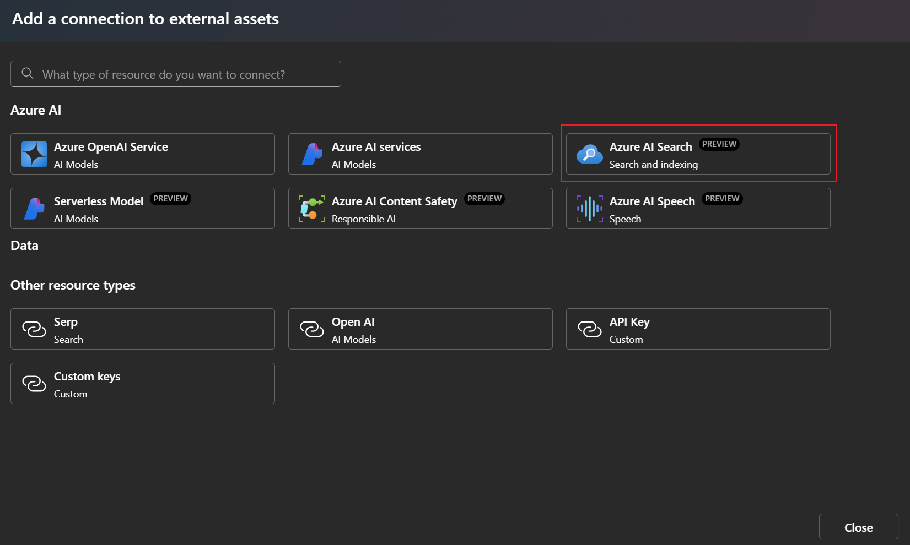
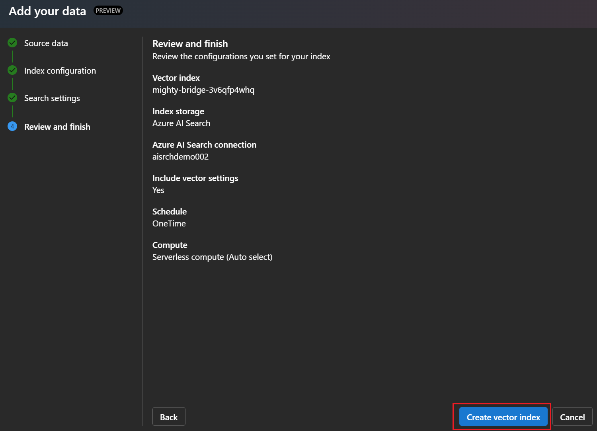

# Azure OpenAI On Your Data Workshop

In this workshop, you will learn how to use Azure OpenAI On Your Data to chat with the NIH’s 321 page PDF for preparing and submitting grant applications to Grants.gov. You will be able to ask questions and get answers from the guidelines using natural language, as well as analyze and summarize the content using powerful language models such as GPT-35-Turbo and GPT-4.


- [Azure OpenAI On Your Data Workshop](#azure-openai-on-your-data-workshop)
  - [Create an AI Hub Respource](#create-an-ai-hub-respource)
  - [Create an AI Search Resource](#create-an-ai-search-resource)
  - [Access Azure AI Studio](#access-azure-ai-studio)
  - [Connect Azure AI Search to the Hub](#connect-azure-ai-search-to-the-hub)
  - [Connect NIH Document Container to the Hub](#connect-nih-document-container-to-the-hub)
  - [Create Project in existing AI Hub](#create-project-in-existing-ai-hub)
  - [Deploy a GPT-4 model](#deploy-a-gpt-4-model)
  - [Set the System Message](#set-the-system-message)
  - [Add your data](#add-your-data)


## Create an AI Hub Respource

AI hub provide the environment for a team to collaborate and organize work, and help you as a team lead or IT admin centrally set up security settings and govern usage and spend. You can create and manage a hub from the Azure portal or from the AI Studio:

1. From the Azure Portal, search for *Azure AI Studio* in the **Global Search Bar** and select **Azure AI Studio**

    

2. Click on **Create** and select **Hub**

    

3. In the **Basic** tab, select your **Subscription**, then click the **Create new** link under the Resource Group dropdown to create a new Resource Group. Example: **RG-AI-Hub-001** and click **OK**. Select the **Region** in which you want to create the Azure AI Hub.

4. Provide a **Name** for the Azure AI Hub. Example: **AI-Hub-001** and click **Review + Create**

   

5. It will validate the configuration and then click **Create** to create the Azure AI Hub.

   

6. The deployment will take a few minutes to complete. Once the deployment is complete, click on **Go to resource** to navigate to the Azure AI Hub. Click on the **Storage** in the right to view the storage account created for the Azure AI Hub.

   

7. From your storage account's page, select **Containers** from the left-hand navigation pane and create a new container called *nih-documents* and then click **Create**.

    

8. Click on your new **nih-documents** container and upload the [NIH grant writing manual](data/general-forms-h.pdf).

    

## Create an AI Search Resource

An AI Search service in Azure is another requirement for models to chat with and analyze your own data. AI Cognitive Search service is where you index and enrich your data source, such as a PDF document, a web page, or a database. AI Search service also provides retrieval and augmentation benefits, such as natural language processing, semantic ranking, and faceted navigation.

1. From the Azure Portal, search for *Search* in the **Global Search Bar** and select **AI Search**. Next, click **+ Create** at the top of the AI Search section

    

2. Select your Azure OpenAI **Subscription** and the *RG-AI-Hub-001* **Resource Group**. Choose a globally unique **Service Name**, *East US* for the region, and leave **Pricing tier** as *Standard.* Click **Review + Create** and finally **Create**.


    

    `Note`: Azure AI Search creation can take a few minutes to complete. Please copy the **name** of the AI Search resource as you will need it later.

3. Once the resoruce is created click the **Go To Resource** button. From your Cognitive Search resource page, select **Semantic Ranker** from the left-hand navigation blade and enable the *Free* tier.

    

## Access Azure AI Studio
1. Open a new brower tab and navigate to the [Azure AI Studio](https://ai.azure.com/)
2. Sign in with your account if you are not already signed in.

    

1. Verify that you are connected to the correct AI Hub


    

## Connect Azure AI Search to the Hub

1. Create a **New Connection** under **Connected Resources**

    

2. Select **Azure AI Search (Preview)**

    

3. Search the **Azure AI Search (Preview)** resource you created earlier and click **Add connection** and **close**

    

## Connect NIH Document Container to the Hub

1. Create a **New Connection** under **Connected Resources**

    

2. Select **Azure Blob Storage (Preview)**, Select the correct **Subscription**, **Storage Account**, click **nih-documents** container, **Authentication Method** to *Microsoft Entra ID based* and provide the **Connection name** and click **Add connection**

    

## Create Project in existing AI Hub

Projects are hosted by an Azure AI Studio hub that provides enterprise-grade security and a collaborative environment.

1. Create new project in the existing AI Hub, provide the project name and click **Create a project**


    


## Deploy a GPT-4 model

Models, such as GPT-3 or GPT-4, must be deployed for you to use them. When you deploy a model in Azure OpenAI, you create an instance of the model that you can use and access through a REST API or the web-based interface in the Azure AI Studio. This allows you to chat with and analyze your own data using the model’s capabilities. You can also fine-tune and prompt the model for specific tasks and scenarios by deploying a model.

1. Navigate to the **Deployments** under *Components* in your project and click **Deploy a model**

    

1. Search the model you want to deploy, for example, *GPT-4*, Select the model and click **Confirm**

    

1. Click on **Customize** to configure the deployment settings

    

1. Please provide **Name** for the deployment, select the **Deployment type** to *Standard*, **Model Version** to *0125-Preview* and **Token per Minute Rate Limit** to *30K* and click **Deploy**

    

1. Once the deployment is complete, open the model in the playground

    

## Set the System Message

A system message is a type of prompt that can be used to guide the behavior and performance of a chat model in Azure OpenAI On Your Data. A system message can define the model’s profile, capabilities, limitations, output format, examples, and guardrails for a specific scenario. A system message can help increase the accuracy and grounding of the model’s responses based on the user’s data.

1. Copy the following system prompt into your clipboard:
```
Your name is GrantGPT, a friendly and helpful grant-writing assistant tasked with helping a principal investigator (PI) write grant research grant proposals, receive feedback on their proposals, and answer questions on the NIH's grant writing guidelines. You have been grounded on the NIH's grant writing guidelines and that is the only source of data you are allowed to use to answer questions. If there isn't enough information, say you do not know. If asking clarifying questions to the user would help, ask the question.
```

1. Paste the contents of your clipboard into the **Give the model instructions and context** text box. Next, click **Save.**


2. After your System Message has been saved, test the chatbot by asking it how it can help you.

    

## Add your data
1. From the *Chat* section of *Azure AI Studio* click **Add your data (preview)** followed by **+ Add a new data source**.

    

2. Select your data source, make sure to select **Azure Blob Storage** and **nih_documents** blob store and then select the *general-forms-h.pdf* click **Next**

    

3. Select the **Azure AI Search Service** and related configuration and click **Next**

    

4. Select **Add vector search for this search resource**, select Azure OpenAI connection and click **Next**

    

    `Note`: It will deploy embadding model behind the scene, if its not already deployed.

5. Click **Create vector index**

    

6. Monitor the **Ingestion Status**

    
    
7. Once the data is added, you can test the chatbot by asking questions about the NIH grant writing guidelines.